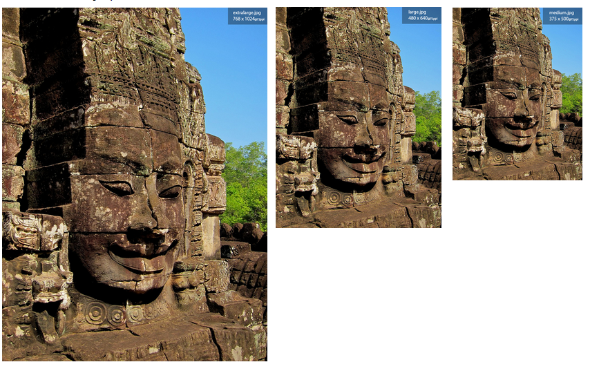

# [imageResponsive](https://github.com/eddyystop/mithril-components/tree/master/components/imageResponsive)

Mithril.js integration to [picturefill](http://scottjehl.github.com/picturefill/)
a responsive image polyfill for <picture>, srcset, sizes, and more.

You can read more about <picture>
[here](http://scottjehl.github.io/picturefill/)
and [here](http://picture.responsiveimages.org/).


## Sample usage
#### Results (shown at 3 CSS media query breakpoints)


#### Run it
Point browser at /mithril-components/public/imageResponsive.html .

#### Code
```
<script src="js/vendor/mithril.js"></script>
<script src="js/vendor/picturefill.js"></script>
<script src="../components/imageResponsive/imageResponsive.js"></script>

var app = {
    controller: function () {
      this.image = new mc.ImageResponsive.controller();
    },
    
    view: function (ctrl) {
      return [
        m('h3', 'You will see 3 different sized images as you narrow the browser width'),
        m('div', mc.ImageResponsive.view(ctrl.image, {
          sources: [
            { srcset: "images/extralarge.jpg", media: "(min-width: 1000px)" },
            { srcset: "images/large.jpg", media: "(min-width: 800px)" },
            { srcset: "images/medium.jpg" }
          ],
          img: img = {
            srcset: "images/medium.jpg",
            alt: "A giant stone face at The Bayon temple in Angkor Thom, Cambodia"
          }
        }))
      ];
    }
};

m.module(document.body, app);
```

## Controller
```
controller: function () {
  this.component = new mc.tableResponsive.controller()
}
```

## View
```
view: function (ctrl) {
  return mc.tableResponsive.view(ctrl, options);
}
```

* `ctrl {obj}` is the controller.
* `options {obj}` contains the following mandatory properties:
    * `sources {array of source}` the alternate images depending on the media width.
    The image displayed is the first one satisfying its media query.
        * `source {obj {srcset:..., media:...} } the image for this media query
            * `srcset {URL | default is empty str}` the URL of the image.
            * `media {media query | default is empty str}` 
            the media condition to be satisfied, e.g. `media: "(min-width: 1000px)"`.
    * `img {obj {srcset:..., alt:...} }` The standard image.
        * `srcset {URL | default is empty str}` the URL of the image.
        * `alt {str | default is empty str} a description of the image.