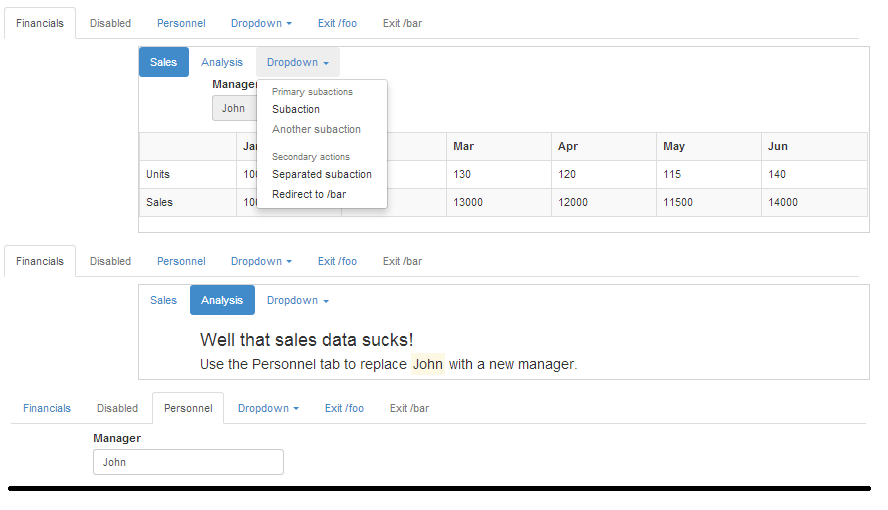

# [tabs](https://github.com/eddyystop/mithril-components/tree/master/components/tabs)

Display tabs.
 
A render function is supported for each tab, 
and it renders the tab's contents when the tab is active.
Each tab has an optional onclick handler. 
This may either redirect to another 'page' or be a customized function.

## Sample usage
#### Results


#### Run it
Point browser at /mithril-components/public/tabs.html .

#### Code
```
<link href="vendor/bootstrap/css/bootstrap.css" rel="stylesheet" type="text/css">
<link href="../components/tableResponsive/occlusionTable.css" rel="stylesheet" type="text/css">

<script src="js/vendor/mithril.js"></script>
<script src="../components/utils/mcUtils.js"></script>
<script src="../components/table/table.js"></script>
<script src="../components/tabs/tabs.js"></script>

var model = {
  mgrName: m.prop('John'),
  activeTabMain: m.prop('finance'),
  activeTabSub: m.prop('period')
};

// app =========================================================================
var app = {
  controller: function () {	},
  view: function (ctrl) {
    var self = this,
      tabOptions = {
        activeTabName: model.activeTabMain,
        css: 'bs',
        tabs: {
          'finance': {
            label: 'Financials',
            render: function () { return self.renderFinanceContents(); },
            onclick: function () { console.log('tab finance was clicked'); }
          },
          'staff': {
            label: 'Personnel',
            render: function () {
              return [
                m('p'),
                m('form.col-md-offset-1.col-md-3',
                  m('.form-group', [
                    m('label', 'Manager'),
                    m('input.form-control',
                      {onchange: m.withAttr('value', model.mgrName), value: model.mgrName()}
          )]))];}},
          'exit': {
            label: 'Exit',
            onclickRedirectTo:  '/foo'
          }
        }
      };

    return m('.container', [
      m('p'),
      mc.Tabs.view(ctrl.tabs, tabOptions)
    ]);
  },

  renderFinanceContents: function () {
    var tabOptions = {
      activeTabName: model.activeTabSub,
      css: 'bs',
      tabs: {
        'period': {
          label: 'Sales',
          render: function () {
            var salesCtrl = new sales.controller();
            return sales.view(salesCtrl);
          }
        },
        'comment': {
          label: 'commentary',
          render: function () {
            return m('.row .col-md-offset-1', [
              m('h3', 'Well that sales data sucks!'),
              m('h4', [
                m('span', 'Use the Personnel tab to replace '),
                m('span.mark', model.mgrName()),
                m('span', ' with a new manager.')
        ])]);}}
      }
    };

    return [
      m('.row', [
          m('p'),
          m('.col-md-offset-2', {style: {border: '1px solid Lightgrey'}}, [
              mc.Tabs.view(null, tabOptions)
    ])])];
  }
};

// sales =======================================================================
var sales = {
  period: [
    ['',      'Jan', 'Feb', 'Mar', 'Apr', 'May', 'Jun'],
    ['Units', 100,   125,   130,   120,   115,   140],
    ['Sales', 10000, 12500, 13000, 12000, 11500, 14000]
  ],

  controller: function () {
    this.tableCtrl = new mc.Table.controller(m.prop(sales.period));
  },

  view: function (ctrl) {
    return [
      m('form.col-md-offset-1.col-md-3',
        m('.form-group', [
            m('label', 'Manager'),
            m('input.form-control', {disabled: true, value: model.mgrName()})
          ]
        )
      ),
      mc.Table.view(ctrl.tableCtrl, {selectors: {parent: '.table .table-bordered .table-striped'}})
    ];
  }
};

// foo =========================================================================
var foo = {
  controller: function () { },
  view: function () {
    return m('h1.col-md-offset-1.bg-warning', 'We have redirected to /foo');
  }
};

// routing =====================================================================
m.route(document.body, '/', {
  '/': app,
  '/foo': foo
});
```

## Controller

You need not instantiate a controller, though you can.

The tabs component is used within rendering functions, 
and it turns out its awkward to idiomatically instantiate a controller.
One state element is passed to the view, so this certainly is not the 'right' Mithril way of doing things.
However we're letting practically win here.


## View
```
view: function (ctrl) {
  return mc.tableResponsive.view(ctrl, options);
}
```

* `ctrl {obj}` is the controller.
* `options {obj}` contains the following properties:
    * `activeTabName {fcn | str | defaults to first tab}`
    The name of the currently active tab. The default is the name of the first tab in `tabs`.
    * `css {str optional}` Create a component for use with the specified CSS framework. 
    Otherwise the `selectors` and `attrs` properties are expected to style the component.
    The supported values are:
        * `"bs"` Bootstrap.
    * `tabs {obj {tabName1:{...}, ...} required}` Definition of the tabs. 
    The tabs are rendered in the stored order, i.e. Object.keys().
    Each tab contains:
        * `tabName: { label:, render:, onclickRedirectTo:, onclick:, selectors:, attrs: }` 
        Definition of one tab.
            * `label {fcn | str | default is tabName}` The text to appear as the label.
            * `render {fcn optional}` Fcn which renders the tab's contents if the tab is active.
            * `onclickRedirectTo {str URL | fcn returning URL | optional}` 
            Redirect to this route if the tab is clicked.
            * `onclick {fcn optional}`
            Call this fcn when the tab is clicked. Ignored if `onclickRedirectTo` is specified.
            The current module is automatically re-rendered after a tab is clicked,
            so this optional fcn would perform other specialized processing before the re-render.
            * `selectors {obj}` are the Mithril selectors attached to various elements in the table.
            They are applied after any selectors added by `css`.
            * `attrs {obj}` are the Mithril attrs attached to various elements in the table.

You can set the activeTagName to the current route name as follows:
```
options.activeTagName = m.route.param('tab');
...
m.route(document.body, '/', {
  '/': app,
  '/:tab': app
});
```
    
You can call a rendering function for a tab with:
```
render: function () {
    return m('form.col-md-offset-1.col-md-3',
        m('.form-group', [
         m('label', 'Manager'),
         m('input.form-control',
           {onchange: m.withAttr('value', model.mgrName), value: model.mgrName()}
         )
        ])
    );
}
```

You can render a sub-app which contains a controller and view with:
```
render: function () {
    var salesCtrl = new sales.controller();
    return sales.view(salesCtrl);
}
```

`selectors` and `attrs` specify the Mithril selectors and attrs to be attached to 
different locations in the structure. The locations are:
* `parent` The < ul>.
* `item` and `itemActive` The < li> for every item.
* `link` and `linkActive` The < a> for even link.

The Bootstrap `css` injects the selectors:
```
{ parent: '.nav.nav-tabs', itemActive: '.active' };
```